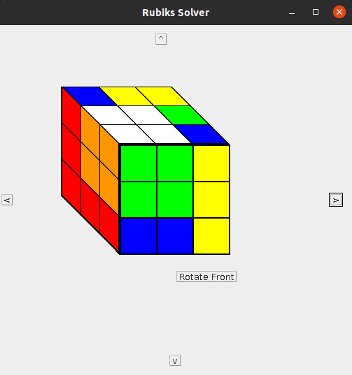

# rubIQs

rubIQs is a programmatic Rubik's Cube simulator with a primitive GUI

## RubiksCube API

- `new RubiksCube()` - initializes a new, solved Rubik's Cube object  
- `getCube()` - returns a 3d array of Colors representating of the Rubik's Cube  
- `isSolved()` - returns a boolean value. True iff all sides consist of only 1
color  
- `scramble([int iterations])` - shuffles the rubik's cube by making
*iterations* turns. If not specified, *iterations* defaults to 30
- `traceScramble()` - Prints each side and rotation direction during a scramble
process.  
- `rotate(Color side, Direction dir)` - Rotate the side with the center square
whose color matches the specified color. Valid directions are `CLOCKWISE` and
`COUNTER_CLOCKWISE`.

## GOALS

### GUI

- [ ] Animations
- [ ] 3D modeling

### Automatic Solving

- [ ] Algorithmically (using Java)
- [ ] AI model
- [ ] Logically (using Prolog)
